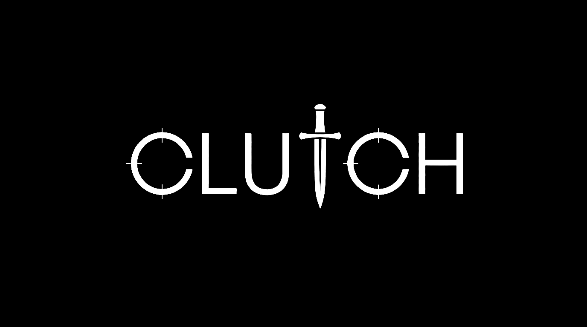

<div align="center">

</div>

# CLUTCH

Telegram-проект про киберспорт. По сути это поиск тиммейтов по рангу плюс вокруг него я навесил автоматизацию контента для телеги и инсты, чтобы канал и бот сами себя наполняли и подкармливали трафиком.

Бот живой, крутится 24/7: [@clutch_gg_bot](https://t.me/clutch_gg_bot)
Новостной канал: [@clutch_news_gg](https://t.me/clutch_news_gg)


## Что это вообще

Если коротко — три штуки в одном, и они между собой связаны.

Первое, сам бот. Игрок заходит, заполняет анкету (игра, ранг, что ищет), и я ему подбираю напарников примерно своего уровня. Без вот этого когда в катке к тебе падает рандом который вообще не тащит.

Второе, контент. Канал не хочется вести руками каждый день, поэтому новости, картинки, посты про матчи — всё постится само по расписанию. И это же зеркалится в инсту, чтобы оттуда тоже шли люди.

Третье, это уже для себя — видео-студия прямо в чате. Кидаю боту сырое видео, тыкаю кнопки какие эффекты нужны, он мне на выходе отдаёт готовый вертикальный ролик и сразу выкладывает куда надо. Reels, сторис, телега — за один заход.

Делал всё сам, от и до. Бэк, база, видео-пайплайн, дизайн, деплой.

## Что умеет

**Бот**
- анкеты по рангу под CS2, Dota 2, Valorant и ещё кучу игр
- подбор тиммейтов своего уровня, рулетка напарников
- рейтинг, рефералка, буст профиля за Telegram Stars, связка с Discord

**Контент сам по себе**
- новости в канал: парсю источники, генерю брендированную картинку, кидаю по 5 постов в день в рандомное время плюс утреннее и вечернее приветствие
- премиум-эмодзи прямо в постах канала (об этом ниже, там был отдельный гемор)
- живые матчи CS2 и Dota2 через PandaScore — перед игрой автоматом кидаю опрос-прогноз, после игры результат
- AI пишет подводки в фирменном дерзком тоне
- новости автоматом улетают ещё и в инсту

**Видео-студия в чате**
- цветокор и HDR, зум, плавное появление, интро и аутро клею
- лого и любые оверлеи в нужный угол
- музыка, причём можно оставить и оригинальный звук, просто потише
- субтитры по словам (распознаю речь и накладываю)
- вырезаю паузы и тишину
- обложка
- формат всегда 9:16, без вот этого мыла и сплющивания
- и публикация в один клик сразу в Reels, сторис инсты, канал телеги и сторис телеги

## Как это собрано

```
        игроки                                            я (видео, команды)
          |                                                       |
          v                                                       v
   +-------------------------- aiogram 3.x (Bot API) --------------------------+
   |                            FSM, инлайн-кнопки                              |
   +---------------------------------+----------------------------------------+
                                     |
        +----------------------------+----------------------------+
        v                            v                            v
   SQLite                     видео-движок                 юзербот (Telethon)
   анкеты, рейтинг            ffmpeg, 9:16, субтитры        премиум-эмодзи,
                                     |                      большие видео
        +-------------+-------------+-------------+-------------+
        v             v             v             v             v
   PandaScore     Deepgram      Gemini/Claude  Instagram     Telegram
   матчи          распознавание AI             Graph API     каналы, сторис
```

Все фоновые штуки (новости, матчи, ночной пост) это отдельные асинхронные петли со своим расписанием по Москве. Лежит на Railway, работает круглосуточно, состояние в SQLite на постоянном диске.

## Стек

| Слой | Чем делал |
|---|---|
| Бэк | Python 3.11, asyncio, aiogram 3.x, SQLite |
| Юзербот | Telethon (MTProto) — премиум-эмодзи в канал и видео больше 20 мб |
| Видео | ffmpeg через imageio-ffmpeg, Pillow |
| Распознавание речи | Deepgram, тайминги по словам, ру и англ |
| AI | Gemini 2.0 / Claude |
| Матчи | PandaScore API |
| Instagram | Graph API, Content Publishing |
| Деплой | Railway, 24/7 |

## Что было непросто

Тут пара вещей над которыми реально пришлось посидеть.

Премиум-эмодзи в канале. Bot API ботам тупо не даёт ставить кастомные эмодзи в каналы. Пришлось поднимать отдельный юзербот на Telethon который постит уже от premium-аккаунта, и через него эмодзи проходят.

Видео 9:16 без вылета по памяти. Сначала делал в лоб — сначала увеличить, потом обрезать. На сервере это создавало гигантский промежуточный кадр и процесс убивало по памяти, бот выкладывал нелепый квадрат. Переделал так чтобы сначала резать потом масштабировать, плюс ограничил потоки. Теперь стабильно вертикаль без искажений.

Субтитры. В сборке ffmpeg которая у меня нет drawtext и libass, то есть текст прямо так не наложить. Поэтому каждое слово рендерю в png через Pillow и накладываю по таймкодам которые получаю из распознавания.

Лимит 20 мб. Бот через Bot API не может скачать большое видео. Поэтому файл забирает юзербот напрямую по MTProto, а дальше уже обработка.

Ну и токен инсты чтобы автопостинг не отваливался каждые пару месяцев — обменял на постоянный, и учёл мёртвые зоны интерфейса Reels чтобы субтитры и оверлеи не лезли под кнопки.

## Про сам репозиторий

Это витрина. Тут архитектура, стек и описание того что и как сделано. Сам код движка я не выкладываю, проект коммерческий и крутится в проде. Если интересно как именно устроено внутри — могу показать и рассказать лично.

---

Kamil. По вопросам в [@clutch_gg_bot](https://t.me/clutch_gg_bot)

© 2026 CLUTCH, все права защищены.
